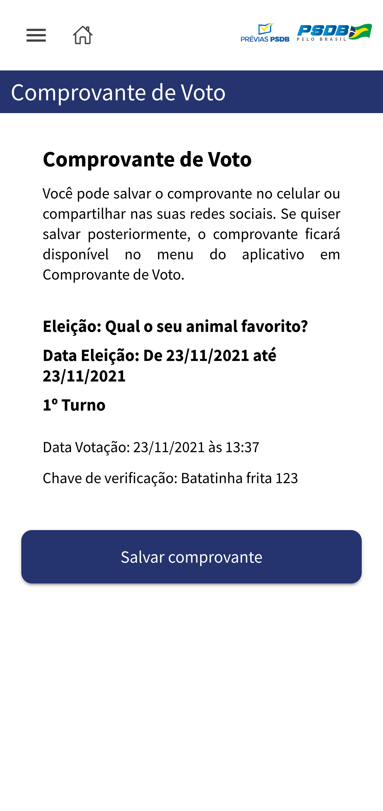

# Análise do Aplicativo Prévias PSDB 2021

Com a [recente polêmica](https://valor.globo.com/politica/noticia/2021/11/21/psdb-seguiu-com-previas-sem-plano-b-para-problemas-em-aplicativo-de-votacao.ghtml) sobre o aplicativo usado nas Prévias do PSDB de 2021, fiquei curioso para saber como era o fluxo de registro e votação, a fim de inferir se o aplicativo seguia algumas das boas práticas para votações pela internet.

Para isso, baixei o aplicativo na [Play Store](https://play.google.com/store/apps/details?id=previas.app.br.org.psdb) e extraí o `base.apk` do meu celular. Não vou distribuir esse arquivo para não correr o risco de violar os direitos autorais de ninguém. Para verificar se você tem a mesma versão que eu, confira os hashes:

```
$ md5sum base.apk
c558a1b54505ae97dd4c6a6ebd428a56  base.apk
$ sha1sum base.apk
9ea63858973d58b9001ca5af4adb5f6315ecb93d  base.apk
$ sha256sum base.apk
25f2b4b3ed1bd356246b8eed21b43208a15cc205f04f30be6b038f12f5e7a456  base.apk
```

Para testar o fluxo de votação no seu próprio computador, copie o arquivo `base.apk` para o diretório `client`. Em seguida, execute `make` dentro do diretório `client` em um terminal, e `make` dentro do diretório `server` em outro. Por fim, acesse http://localhost:8080. Coloque seu navegador em modo de desenvolvimento mobile se quiser ver as telas da forma como ficariam formatadas em um celular.


## Telas do aplicativo

**Importante**: Não sou detentor dos direitos autorais do layout das telas ou dos logotipos abaixo exibidos. Estes são de propriedade exclusiva do PSDB, reproduzidos aqui apenas para fins de estudo, crítica ou polêmica. Fotos do cachorro são de propriedade da Netflix, retiradas da obra [Cowboy Bebop](https://www.netflix.com/title/80207033). Fotos do Darth Miau usadas com autorização.

### Fluxo de registro do eleitor

1. O eleitor insere o número do título de eleitor


2. O aplicativo informa que se trata do primeiro acesso


3. O eleitor preenche zona, UF e telefone celular


4. O aplicativo pede para o eleitor enviar foto da frente e do verso do documento, além de uma foto segurando o documento


5. Uma vez carregadas as fotos, é possível avançar e concluir o registro


### Fluxo de votação

1. O eleitor insere o número do título de eleitor


2. O eleitor tira uma selfie


3. O eleitor preenche um código recebido por SMS


4. Aparece o menu principal


5. O eleitor seleciona uma eleição


6. O eleitor escolhe um candidato


7. O eleitor confirma o candidato escolhido


8. O eleitor tira novamente uma selfie


9. O eleitor preenche novamente um código recebido por SMS


10. Aparece um comprovante de voto




## Análise e discussão

**Importante**: A análise abaixo é pautada exclusivamente no comportamento do cliente que foi observado interagindo com um servidor local *mockado* de minha própria autoria. Em momento algum tive acesso ao código fonte do servidor ou a respostas de requisições ao servidor real. É importante ressaltar que as críticas abaixo realizadas **não implicam** necessariamente na possibilidade de violar a votação ou de se passar por eleitores em larga escala.


### Autenticação do eleitor

As seguintes informações são enviadas para o servidor e **podem** estar sendo usadas para autenticar o eleitor (é impossível afirmar com certeza quais estão sendo de fato usadas sem observar o comportamento do servidor):

 * UUID da instalação do aplicativo gerado usando `Math.random()`.
 * Informações do dispositivo, contendo fabricante, sistema operacional, versão do SO.
 * Título de eleitor.
 * Selfie do eleitor.
 * Código recebido por SMS no celular do eleitor.

Podemos mencionar algumas limitações a respeito do uso dessas informações para autenticação:

 * A função `Math.random()` [não é](https://stackoverflow.com/questions/5651789/is-math-random-cryptographically-secure) criptograficamente segura.
 * Informações do dispositivo podem ser inferidas se você souber qual o modelo de celular do eleitor ou convencê-lo a acessar determinado site.
 * O TSE costumava publicar ([link quebrado](https://cdn.tse.jus.br/estatistica/sead/odsele/filiacao_partidaria/filiados_psdb.zip)) uma lista com o título de eleitor de todos os filiados de cada partido.
 * O servidor dispõe de poucas informações para treinar um algoritmo de reconhecimento facial, provavelmente só a selfie tirada com o documento ao realizar o registro na votação. Isso significa que o algoritmo ou é extremamente tolerante (deixa passar qualquer rosto minimamente parecido com o eleitor), ou extremamente rígido (não aceita nem uma selfie legítima do eleitor).

 No entanto, o uso de múltiplo fator de autenticação é um ponto positivo da solução implementada.


### Registro do voto

O servidor tem acesso ao voto às claras, em outras palavras, o servidor tem acesso a informações suficientes para inferir (dependendo do software ou hardware que estiver instalado nele) qual voto foi depositado pelo eleitor:


A *chave de verificação* que consta no *comprovante de voto* não tem correlação com o candidato escolhido pelo eleitor, logo não é possível ter certeza que o voto contabilizado realmente corresponde à escolha do eleitor.

Em resumo, trata-se de um sistema similar a um sistema de enquetes.


## Conclusões

Diante das críticas apresentadas acima, recomenda-se ao PSDB substituir o aplicativo atualmente utilizado por uma plataforma consagrada, de código aberto e verificável fim-a-fim, como o [Helios Voting](https://vote.heliosvoting.org), para realizar suas Prévias. No Brasil, há larga experiência no uso dessa plataforma em universidades como o [IFSC](https://helios.ifsc.edu.br), a [UFSCar](https://votacao.ufscar.br), a [USP](https://votacao.usp.br), a [Unicamp](https://evoto.unicamp.br), dentre diversas outras.

A verificabilidade fim-a-fim é considerada um requisito essencial para um sistema de votação online. Sistemas verificáveis fim-a-fim, como o Helios, fornecem um código de rastreamento que provê uma garantia criptográfica ao eleitor de que seu voto foi realmente contabilizado no resultado final.

